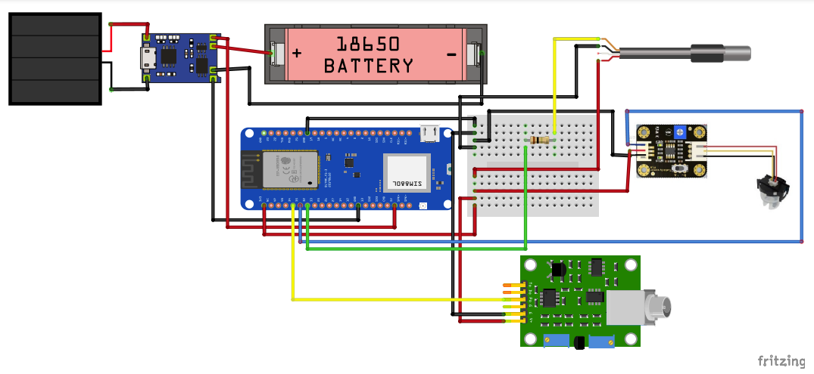

<h1 align="center"></h1>

<h1 align="center">
    
</h1>

[](https://github.com/mas-cli/mas/blob/main/LICENSE)

<h1 align="center"> Sistema de Monitoramento em Tempo Real de Qualidade de Água de um Rio </h1>

O projeto Sistema de Monitoramento em Tempo Real de Qualidade de Água de um Rio faz parte da chamada pública [CGI.br/NIC.br/Ceweb.br nº 01/2019
Mover-Se na Web – Articulação Pró-Brumadinho](https://ceweb.br/projetos/chamada.html)

#  Descrição da solução

Neste projeto foi desenvolvido um protótipo de estação de monitoramento de qualidade da água de baixo custo utilizando a plataforma Arduino/ESP que se comunica com um sistema web desenvolvido com a framework Django, Bootstrap e PWA. Ao todo o projeto é composto por três componentes principais: (i) a aplicação web, (ii) o hardware que compõem a estação de monitoramento, (iii) e o firmware que foi desenvolvido para a placa LILYGO® TTGO T-SIM7000G. 

<p align="center">
    
</p>

<p align="center">
    
</p>

## Funcionalidades ativas

- [x] Criação de Usuário
- [x] Cadastro de Estação
- [x] Cadastro de Nascente
- [x] Cadastro de Alerta
- [x] Visualização de Perfil
- [x] Cadastro Manual de Dados
- [x] API para Recebimento de Dados
- [x] Visualização de Dados Históricos 
- [x] Carregamento Solar*
- [x] Desligamento Programado para Economia de Energia (_Deep Sleep_)*
- [x] Envio de Dados via WiFI*

\* Estação de Monitoramento (Hardware / Firmware).

## Papéis e suas descrições

-  Visitante: Qualquer pessoa que acesse ao sistema web sem possuir um usuário cadastrado no sistema.
-  Usuário Comum: Qualquer pessoa que tenha um usuário cadastrado no sistema. O usuário pode cadastrar dados em estações já criadas pelo administrador.
-  Administrador: Qualquer pessoa que tenha um usuário cadastrado no sistema com a permissão de administrador. Essa permissão o habilita a acessar o painel de administração. O administrador será notificado quando um usuário solicitar o cadastro no sistema. 

#  Instalação

## Tecnologias utilizadas

- [Django](https://www.djangoproject.com/)
- Progressive Web App (PWA)
- [Bootstrap](https://getbootstrap.com/)
- Placa ESP32 ([LILYGO® TTGO T-SIM7000G](https://pt.aliexpress.com/item/4000542688096.html))

## Executando a Aplicação Web

### Pré-requisitos

- [Git](https://git-scm.com)
- [Python](https://nodejs.org/en/). 
- [Redis](https://redis.io/) \* 

\* Funcionalidade de Alerta


### 1. No Terminal

```bash
# Clone este repositório
$ git clone https://github.com/cewebbr/mover-se_monitoramento-qualidade-agua

# Acesse a pasta do projeto no terminal
$ cd mover-se_monitoramento-qualidade-agua/web

# Instale as dependências
$ pip install -r requirements.txt

```
###  2. Configuração das Variáveis de Ambiente

Na pasta `web/bws/bws` há o arquivo `.env` padrão que será utilizado na execução do projeto. Há também o arquvo `.env-prod` com um exemplo
de configuração utilizando o banco de dados PostgreSQL. 

**.env**
```
DEBUG=on
PROD=off
SECRET_KEY='o01wgdlan@h0w#re(&kk03bgzf*!afrz^vy*ifhk9g(rmcb!(s'
ALLOWED_HOSTS=['*']

DATABASE_URL=sqlite:///db.sqlite3
CELERY_BROKER_URL="redis://localhost:6379"

EMAIL_HOST_USER=""
EMAIL_HOST_PASSWORD=""
EMAIL_HOST="smtp.gmail.com"
DEFAULT_FROM_EMAIL=""
```

O `.env` padrão não possui configuração de servidor SMTP e o banco utilizado é o Sqlite3. O envio de e-mail faz parte de algumas funcionalidades (aleta, troca de senha...), mas não impede da aplicação funcionar. Recomenda-se usar o [sendgrid](https://sendgrid.com/) como _backend_ para envio de e-mail.

###  3. Criação do Banco de Dados e Administrador

```bash
# Execute o comando para criar a base de dados na pasta web/bws
$ python manage.py migrate --run-syncdb

# Criação um administrador do sistema
$ python manage.py createsuperuser
```

###  4. Executando a Aplicação
```bash
# Execute a aplicação com o sevidor de desenvolvimento
$ python manage.py runserver
```
O servidor inciará na porta 8000. Acesse < http://localhost:8000 > para visualizar a aplicação funcionando. 

Para criar entidades do projeto, acesse o sistema com as credenciais do administrador criadas no passo 3 e acesse o painel de administração.
Será necessário criar Sensores, Tipos de Estações e Estações. Além de vincular os sensores existentes às estações criadas.

### 5. Funcionalidade de Alerta
A fucionalidade de alerta é implementada utilizando a framework [Celery](https://docs.celeryq.dev/en/stable/). Para que essa funcionalidade seja ativada é importante que exista uma banco de dados Redis executando segundo as informações configuradas no arquivo `.env`. 

Antes de iniciar a rotina que irá ficar checando os dados enviados para o sistema, se faz necessário criar no banco de dados a entrada da tarefa assíncrona. Essa configuração deve ser feita apenas uma única vez da seguinte forma: acesse o painel de administração e clique em 'Periodic Task'. Adicione uma nova tarefa com as seguintes informações: 

```
Name: <Coloque o nome que desejar>
Task (registered): asynctask.tasks.cron_read_alerts
Interval Schedule: 1 hours
```

<p align="center">
    
  
</p>

Em seguida, clique no botão "Save".  


Para executar o servidor do Celery, acesse a pasta principal (`web/bws`) e digite o comando abaixo:

```
$ celery -A bws worker --beat --scheduler django --loglevel DEBUG 
```

ou execute o script `web/bws/startcelery.sh`

```
$ ./startcelery.sh
```

</br>

## Executando o Projeto de Hardware

### Pré-requisitos
- [Arduino IDE](https://www.arduino.cc/)
- [LILYGO® TTGO T-SIM7000G](https://pt.aliexpress.com/item/4000542688096.html)
- [Mini Painel Solar](https://pt.aliexpress.com/item/4001189122748.html)
- [Sensor PH](https://pt.aliexpress.com/item/32957428276.html)
- [Sensor Temperatura](https://pt.aliexpress.com/item/1005004412646322.html)
- [Caixa de Proteção IP68](https://pt.aliexpress.com/item/4000019605315.html)
- Jumpers

### Configuração

O projeto de hardware requer a utilização dos componentes eletrônicos descritos [anteriormente](#pr%C3%A9-requisitos-1). Em posse deles, o usuário deve montar a estação de monitoramento seguindo o esquemático disponível ([aqui](hardware/img/schematic.png)). Após o hardware montado, o Arduino IDE deve ser configurado seguindo o passo a passo descrito em [ArduinoIDE.md](hardware/ArduinoIDE.md).


# Solução de problemas

Caso seja encotrado algum problema na reprodução dos passos anteriores ou na execução do projeto, entre em contato com [Rodrigo Lira](https://github.com/rodrigoclira) através do contato disponível na seção "Equipe responsável pelo projeto".


<br/>

### Equipe responsável pelo projeto 

- [Gabriel Lima](https://github.com/Gabs19)           - IFPE Campus Paulista - Pessoa desenvolvedora - gagl@discente.ifpe.edu.br
- [Gaston Gouveia](https://github.com/Gastongouveia)  - IFPE Campus Paulista - Pessoa desenvolvedora - glgs@discente.ifpe.edu.br
- [Rodrigo Lira](https://github.com/rodrigoclira)     - IFPE Campus Paulista - Coordenador - rodrigo.lira@paulista.ifpe.edu.br

</br>


# Sobre o [Ceweb.br](https://ceweb.br/sobre-o-ceweb-br/), [NIC.br](https://www.nic.br/sobre/) e [CGI.br](https://cgi.br/sobre/)

### Ceweb.br - Centro de Estudos sobre Tecnologias Web
O Centro de Estudos sobre Tecnologias Web (Ceweb.br) foi criado como um departamento do Núcleo de Informação e Coordenação do Ponto BR (NIC.br) para viabilizar a participação da comunidade brasileira no desenvolvimento global da Web e subsidiar a formulação de políticas públicas. O Ceweb.br nasce inspirado pelos princípios e projetos já desenvolvidos pelo Escritório Brasileiro do W3C (World Wide Web Consortium), hospedado e apoiado pelo NIC.br no Brasil desde 2008, com a missão de promover atividades que estimulem o uso de tecnologias abertas e padronizadas na Web.


### NIC.br - Núcleo de Informação e Comunicação do Ponto BR
O Núcleo de Informação e Coordenação do Ponto BR - NIC.br foi criado para implementar as decisões e os projetos do Comitê Gestor da Internet no Brasil - CGI.br, que é o responsável por coordenar e integrar as iniciativas e serviços da Internet no País.


### CGI.br - Comitê Gestor da Internet no Brasil
O Comitê Gestor da Internet no Brasil tem a atribuição de estabelecer diretrizes estratégicas relacionadas ao uso e desenvolvimento da Internet no Brasil e diretrizes para a execução do registro de Nomes de Domínio, alocação de Endereço IP (Internet Protocol) e administração pertinente ao Domínio de Primeiro Nível ".br". Também promove estudos e recomenda procedimentos para a segurança da Internet e propõe programas de pesquisa e desenvolvimento que permitam a manutenção do nível de qualidade técnica e inovação no uso da Internet

### Equipe Ceweb.br

<ul>
    <li>Amanda Marques</li> 
    <li>Ana Eliza</li>
    <li>Beatriz Rocha</li>
    <li>Caroline Burle</li>
    <li>Diego Cerqueira</li>
    <li>Diogo Cortiz</li>
    <li>Juliana Ribeiro</li>
    <li>Reinaldo Ferraz</li>
    <li>Selma de Morais</li>
    <li>Vagner Diniz</li>
</ul>
