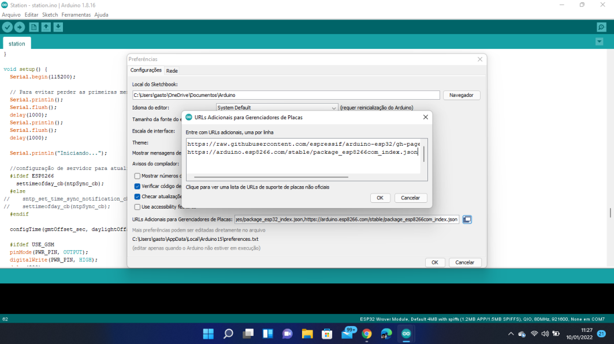
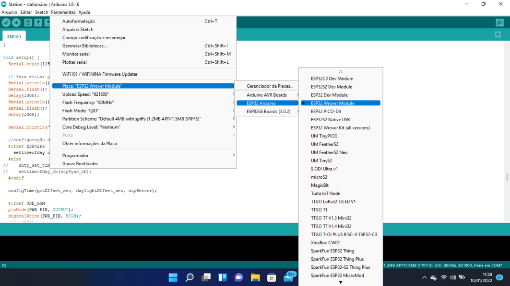

<h1 align="center"></h1>

<h1 align="center">
    
</h1>

<h1 align="center"> Sistema de Monitoramento em Tempo Real de Qualidade de Água de um Rio </h1>

<h2 align="center"> Detalhes da Configuração do Arduino IDE </h2>


Para enviar o sketch da estação (disponível [aqui](sketch/station.ino)) para placa será necessário utilizar o [Arduino IDE](https://www.arduino.cc/en/software). Através dessa ferramenta será necessário instalar as seguintes bibliotecas:

* ArduinoJson
* DallasTemperature
* OneWire 

E adicionar a url das configurações placa TTGO na opção de preferências do Arduino IDE, conforme indicado na documentação da placa TTGO. 



URL: https://raw.githubusercontent.com/espressif/arduino-esp32/gh-pages/package_esp32_index.json

Também será necessário configurar a IDE da seguinte forma, como exibido na figura: 

```
Placa: "ESP32 Wrover Module"
Upload Speed: "921600"
Flash Frequency: "80MHz"
Flash Mode: "QIO"
Partition Scheme: "Default 4MB with spiffs (1.2MB APP/1.5MB SPIFFS)"
Core Debug Level: "Nenhum"
```



A última etapa é plugar a placa na USB do computador e enviar o sketch para a TTGO.
